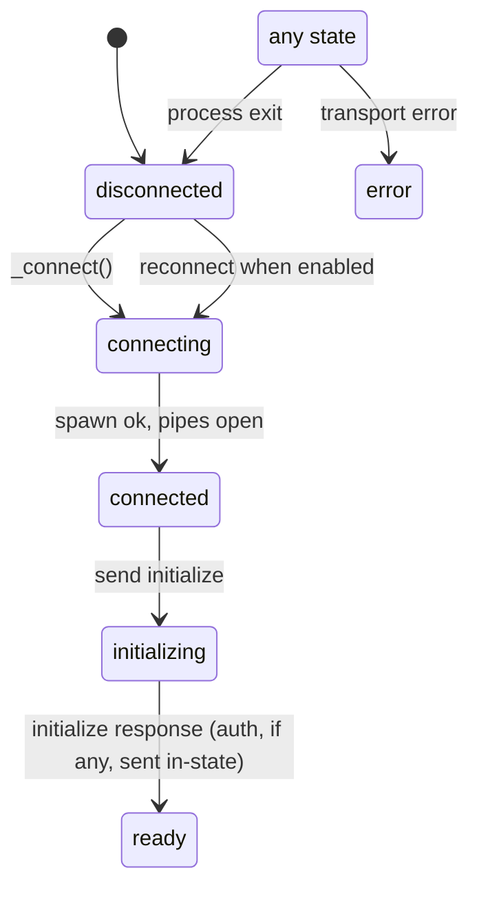

# ACP Client Lifecycle

`ACPClient.state` is driven by transport state changes and RPC responses.

## Invariants

- `_drain_pending_callbacks` runs on every transition to `disconnected` or
  `error`.
- It rejects every pending RPC callback with `TRANSPORT_ERROR`.
- Without draining, `_send_request` callers such as `send_prompt`,
  `create_session`, and `load_session` can hang forever when the provider dies.
- `when_ready` callbacks registered before ready flush at the transition.
- `when_ready` callbacks registered after ready still run via `vim.schedule`.

## Sync vs async dispatch

`ACPClient:_handle_message` runs in the libuv stdout callback, i.e. fast event
context.

- RPC response callbacks from `_send_request` fire synchronously in fast context.
- Session-update notifications cross `vim.schedule` inside `ACPClient`, so
  subscribers run on the main loop.
- Buffer writes, most `vim.api.*` calls, and `Logger.notify` from RPC callbacks
  must be wrapped in `vim.schedule`.
- Do not schedule the RPC branch globally; doing so defers `initialize` state
  changes and lets same-read notifications observe inconsistent state.
- Do not run notification subscribers synchronously; UI writes would crash in
  fast context.

## Reconnect

- `ACPProviderConfig.reconnect` defaults to `false`.
- When enabled, process exit defers two seconds and respawns up to
  `max_reconnect_attempts` times, default 3.
- Pending callbacks are rejected on each disconnect/error, so reconnect does not
  strand callers.
