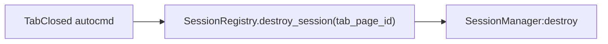

# Agentic Runtime Safety

Every runtime feature must be multi-tab safe.

## Architecture

- `SessionRegistry` maps `tab_page_id -> SessionManager`.
- `AgentInstance` owns one shared ACP provider subprocess per provider.
- Each tabpage owns one ACP session ID, `SessionManager`, `ChatWidget`, status
  animation, permission manager, file list, and code selection.
- Per-tab runtime data belongs on tab-scoped instances or Neovim scoped storage,
  never module-level mutable variables.

## Public API chain

`lua/agentic/init.lua` is the public surface. Anything reached through this chain
inherits its safety guarantees.

```lua
SessionRegistry.get_session_for_tab_page(nil, function(session)
    session.widget:show()
end)
```

Inside the callback:

- Tabpage and session are resolved against the requested tab.
- Callback is wrapped in `pcall`; errors are notified, not raised.

Outside the callback:

- Bare-return calls can return `nil` when no ACP provider is configured.
- After `vim.schedule`, re-enter via the callback form with `self.tab_page_id`
  or validate `nvim_tabpage_is_valid(self.tab_page_id)`.
- Never use the `nil` form after a schedule boundary when the original tab
  matters; `nil` resolves to the then-current tab.

## Scoped storage

Use the narrowest valid scope.

| Scope   | Accessor         | Purpose          |
| ------- | ---------------- | ---------------- |
| Buffer  | `vim.b[bufnr]`   | Custom variables |
| Buffer  | `vim.bo[bufnr]`  | Built-in options |
| Window  | `vim.w[winid]`   | Custom variables |
| Window  | `vim.wo[winid]`  | Built-in options |
| Tabpage | `vim.t[tabpage]` | Custom variables |

- `vim.b`, `vim.w`, and `vim.t` are custom variables.
- `vim.bo` and `vim.wo` are built-in options.
- Invalid option names in `vim.bo` or `vim.wo` throw.
- Write window-local options through `vim.wo[winid][0].opt = value` so they stay
  local to the window/buffer pair.

## Isolation rules

- Module-level constants are fine.
- Module-level namespace IDs are fine: namespaces are global, extmarks are
  buffer-scoped.
- Module-level mutable per-tab runtime state is forbidden.
- Highlight groups are global and defined in `lua/agentic/theme.lua`.
- Buffers and windows are tabpage-specific; use `vim.api.nvim_tabpage_*` APIs
  when looking up or validating UI state.
- For window lookups, use `vim.api.nvim_tabpage_list_wins(self.tab_page_id)`.
- Prefer buffer-local autocommands.
- Filter global autocommands by tabpage.
- Use `BufHelpers.keymap_set` and `BufHelpers.keymap_del` for buffer-local
  keymaps. Do not call `vim.keymap.set` or `vim.keymap.del` directly with
  buffer options.

## Cleanup path



## Public entries

- Widget lifecycle: open, close, toggle, rotate layout.
- Context attach: selection, files, diagnostics.
- Session operations: new, restore, stop.
- Provider switch: UI history replay only; the new provider receives no prior
  LLM context.
- Config entry: setup.
