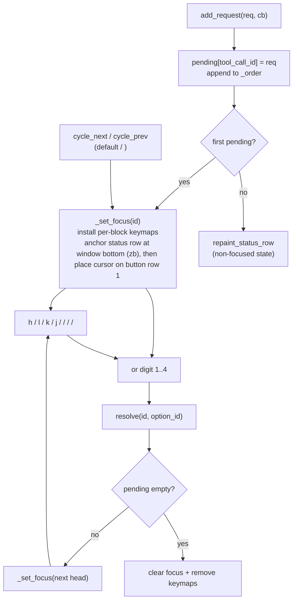

# 0003. Permission buttons

<!-- Filename slug kept for grep stability across history; the subject is
"Permission buttons" since the inline rendering was dropped. -->

- Status: accepted
- Last updated: 2026-05-27
- Commits: -
- Related: -

## Context

Inline buttons on row N exhibited two failures and one product gap:

1. **Wrap mid-button.** `'breakat'` defaults to `" ^I!@*-+;:,./?"`. Provider-
   supplied `option.name` strings like `"Always allow bash(...)"` contain `/`,
   `.`, `-`, so even with NBSP joining internal spaces the button broke
   mid-text at non-space `breakat` chars. `'breakat'` is a global option
   (`runtime/doc/options.txt`); scoping it to the chat window would affect
   every other Neovim window in the user's session.
2. **Layout overflow on long labels.** Multiple long labels on a single row
   spilled into a second visual row; one button could end up orphaned on its
   own wrapped line, disconnected from the status word.
3. **Static label map hides provider intent.** The fixed `Allow` / `Allow
   Always` / `Reject` / `Reject Always` labels discarded provider-supplied
   text (e.g. Claude Code's `"Yes, and bypass permissions"`) and produced
   identical text regardless of which provider sent the request.

## Current decision

One button per real buffer row, stacked between the bottom anchor pad and the
status row. Each pair of buttons is separated by an empty spacer row, and a
trailing spacer sits above the status row, giving `K = 2 * N` rendered rows
for N options (N button rows + N spacer rows). The status row carries only
the status word (`pending`, `in_progress`, `completed`, `failed`). Long
labels can wrap within their own row; no button ever shares a visual row
with another button or the status word.

Layout: See `ui/AGENTS.md` "Tool-call block layout". The buttons-row addendum:
rows `M+1..M+K` are real text, outside the fold; buttons sit on odd offsets,
spacers on even offsets.

Render pipeline: `PermissionManager:repaint_status_row` callers ->
`MessageWriter:repaint_status_row` -> `MessageWriter:_build_permission_section`
-> `MessageWriter:_render_permission_section`.



### Extmark gravity

The block range extmark uses `end_right_gravity = true` at every
`NS_TOOL_BLOCKS` write site. Inserting K button rows at `bottom_pad_row + 1`
extends the extmark's `end_row` to the new status row; deleting K rows shrinks
it. `get_block_end_row(id)` always points at the status row, regardless of how
many buttons are currently rendered.

### Render bookkeeping

`tracker._rendered_button_count` (written only by
`MessageWriter:_render_permission_section`) tracks the K rendered rows
(buttons + spacers) for the next repaint. Despite the field name it counts
rows, not buttons; `K = 2 * N`.

### Provider-supplied labels

Button text uses `option.name` from the ACP request verbatim. The static
`PERMISSION_OPTION_LABELS` map remains only as a fallback when `option.name`
is nil or empty. Long or non-English labels are accepted; wrap is acceptable
because each button has its own buffer line.

### Concurrency model

- `PermissionManager.pending: table<string, PermissionRequest>` keyed by
  `tool_call_id`. Insertion-ordered `_order: string[]` for navigation.
- New arrivals appended; do not steal focus.
- `resolve(id, option_id)` removes from map + `_order`, fires callback. If the
  resolved id was focused, focus snaps to next head (oldest remaining).

### Two-level focus

- **Block-level** (`Config.keymaps.permission.cycle_next` / `cycle_prev`,
  default `<C-n>` / `<C-p>`): cycles `focused_id` across pending blocks.
- **Button-level** (eight cycle keys: `h`, `l`, `j`, `k`, `<Left>`, `<Right>`,
  `<Up>`, `<Down>`): cycles `focused_button_index` within the focused block.
  `<CR>` submits. Digits `1`..`4` submit option N directly.

Horizontal keys (`h`/`l`/arrows) preserved for muscle memory; vertical keys
(`j`/`k`/`<Up>`/`<Down>`) added so motion direction matches the stacked
layout.

### Row-gated per-block keymaps

Motion / submit keymaps use `expr = true`. On-row they fire the action and
return `""`; off-row they return the original key (replayed via `noremap`).
Gating in `PermissionManager:_cursor_on_focused_row` covers
`[get_button_row(id, 1) .. end_row + 1]`.

Digit keys `1`..`4` are NOT row-gated: direct dispatch from anywhere in the
chat buffer.

### Cursor placement

`PermissionManager:_jump_cursor_to(id)` anchors the status row at window
bottom (`zb`) and then places the cursor on button row 1 (fallback
`end_row`). `PermissionManager:_jump_cursor_to_button(id, idx)` (cycle path)
moves the cursor only; it does NOT re-anchor, since re-anchoring on every
cycle would scroll buttons out of view.

### Auto-scroll suppression

`MessageWriter:_check_auto_scroll` stops following new output when the cursor
sits on a permission-button row OR on a pending block's status row. Dual
check: button rows carry `NS_STATUS` button-hl extmarks; the status row of a
pending block does not, so we additionally scan trackers (short-circuiting on
`tracker.permission`).

### Highlight groups

Three HL groups, defined with backgrounds (button-fill look, not text-color):

```text
AgenticPermissionButtonAllow    bg = #2d5a3d (status_completed_bg), bold
AgenticPermissionButtonReject   bg = #7a2d2d (status_failed_bg),    bold
AgenticPermissionButtonInactive bg = #3a3a3a
```

Each button row gets one full-row segment covering byte cols
`[0, #line)`. Greens / reds reuse the existing status-pill palette
(`COLORS.status_completed_bg` / `COLORS.status_failed_bg`) for visual
consistency with the `pending` / `completed` / `failed` pills.

### Fold interaction

Button rows live outside the fold (below `bottom_pad`); no fold-management
special-case needed. ADR 0001's contract is unchanged.

## Consequences

- `MessageWriter:_build_permission_section` and
  `_render_permission_section` own the per-row rendering; the older
  `_build_status_row` is deleted.
- `MessageWriter:get_button_row(id, index)` replaces `get_button_col(id, index)`
  for cursor placement. Buttons are real text at col 0 on their own row;
  cursor lands at `(row + 1, 0)`.
- `_check_auto_scroll` cost: O(N_blocks) in the worst case (one extmark
  lookup per pending block). The tracker scan short-circuits when no
  permission rows are rendered (`_rendered_button_count == 0`), so resolved
  blocks cost nothing; typically only one block is pending at any time.
- Wrap behaviour: long labels wrap to multiple visual rows within their own
  buffer line. No truncation. If a single provider label is genuinely too
  long for the window width, the user sees a soft-wrapped multi-row button.
- `'breakat'` left at its global default; the project does not mutate it.
  The earlier NBSP-join workaround is removed because per-row stacking
  obviates it.
- ADR 0001 (manual folds) and ADR 0002 (statuscolumn fences) unchanged.

## Rejected / superseded alternatives

| Option                                                                | Reason rejected                                                                                                                                             |
| --------------------------------------------------------------------- | ----------------------------------------------------------------------------------------------------------------------------------------------------------- |
| Inline buttons on row N with NBSP join (this ADR's previous decision) | Long provider labels broke mid-text at `breakat` chars (`/`, `.`, `-`). NBSP only fixed spaces. `breakat` is global so cannot be scoped to the chat window. |
| Set `breakat = " "` globally on chat window setup                     | `breakat` is a global option; setting it from the plugin would affect every other Neovim window in the user's session.                                      |
| Render labels via `virt_text` extmarks                                | Cursor cannot land on a virtual line; loses the cursor-jumps-to-focused-button UX users rely on for selection. Also breaks copy/yank of button text.        |
| Truncate provider labels with ellipsis                                | Loses information; "Always allow bash(...)" truncated to 30 chars tells the user nothing useful. Deferred until a real user issue surfaces.                 |
| Static label map (this ADR's previous decision)                       | Discarded provider intent; identical text regardless of provider; non-English users could not see localised labels their provider already supplied.         |
| `virt_lines` rendering above the status row                           | Same cursor-cannot-land-here problem as `virt_text`; user navigation via `h`/`l`/`<CR>` requires real lines.                                                |
| Hybrid: inline when labels are short, stacked when long               | Layout shifts based on content; unpredictable; tests harder to write. Zed uses an always-stacked flat mode for similar reasons.                             |
| Sequential queue at chat bottom (the pre-ADR-0003 behavior)           | Visual disconnect on multi-block, truncated header, reanchor recursion guard.                                                                               |
| Keep bottom prompt + add inline alongside                             | Two UIs, double bookkeeping, ambiguous focus model.                                                                                                         |
| Click / mouse buttons                                                 | Pure keyboard fits Vim; mouse handling adds OS-dependent quirks.                                                                                            |
| Single focus level (block OR button)                                  | Block-only loses fast direct dispatch via digits; button-only forces manual scrolling to find the right block.                                              |
| Always-on `h` / `l` buffer-local keymaps                              | Hijacks normal cursor navigation while a permission is pending.                                                                                             |
| Autocmd `CursorMoved` install / uninstall keymaps                     | Complex lifecycle; `expr=true` fall-through is a one-line equivalent.                                                                                       |
| Snap cursor back to row N (popup-style)                               | Prevents chat scrolling while a prompt is active.                                                                                                           |
| Bracket wrappers `[ Allow ]`                                          | Visual noise next to bg fill; user feedback during iteration.                                                                                               |
| `link = "DiagnosticOk" / "DiagnosticError" / "Comment"` (fg-only)     | Reads as colored text, not buttons. User asked for bg fill.                                                                                                 |
| Light-bg / dark-fg button palette                                     | User chose existing dark green / red palette for plugin-wide consistency.                                                                                   |
| `]p` / `[p` block cycle keys                                          | Both right-hand pinky, two-key sequence, awkward.                                                                                                           |
| Customizable digits / cycle keys / `<CR>`                             | YAGNI; only `cycle_next` / `cycle_prev` are config'd.                                                                                                       |
| Original plan's `Fold.close_range(..., end_row - 1)`                  | Off-by-one in plan; existing 1-indexed `end_row` already excludes row N from the fold.                                                                      |
| Fold range INCLUDES row N                                             | Buttons hidden when block folded.                                                                                                                           |
| Sticky cursor (no jump on focus change)                               | Loses visual anchor; user might press a digit thinking the wrong block is focused.                                                                          |
| Render agent-supplied `option.name` inline on row N (NBSP-joined)     | Superseded by per-row stacking (this ADR). Same `breakat` failure as the inline decision; left here for traceability.                                       |
| `]p` / `[p` no-op when target equals current focus (single pending)   | Superseded: cycle keys now jump cursor back onto the focused row even when focus does not change (see `PermissionManager:_cycle_focus`).                    |

## Changelog

| Date       | Commit  | Change                                                                                                                                                                                         |
| ---------- | ------- | ---------------------------------------------------------------------------------------------------------------------------------------------------------------------------------------------- |
| 2026-05-13 | initial | Initial implementation per `docs/superpowers/inline-permission-buttons.md`. Concurrent map, head-tracking focus, row N text.                                                                   |
| 2026-05-13 | -       | Two-level focus added: `h` / `l` / `<CR>` for buttons; digits kept; static label map; bg-only highlights, brackets removed.                                                                    |
| 2026-05-13 | -       | Row-gated `expr=true` keymaps; cursor positions on first button column.                                                                                                                        |
| 2026-05-13 | -       | `<C-n>` / `<C-p>` replace `]p` / `[p`; `Config.keymaps.permission.cycle_next` / `cycle_prev` made configurable.                                                                                |
| 2026-05-13 | -       | Digits `1`..`4` ungated (fire from anywhere in the chat buffer); only motion / submit keys (`h`/`l`/`<Left>`/`<Right>`/`<CR>`) remain row-gated.                                               |
| 2026-05-14 | -       | Auto-scroll suppresses follow mode on `NS_STATUS` permission-button rows; no `PermissionManager` focus-row callback.                                                                           |
| 2026-05-27 | -       | Stacked one-per-row buttons supersede inline row N rendering. Provider `option.name` used verbatim. Eight cycle keys (h/j/k/l + arrows). Block focus lands on button row 1. NBSP join removed. |
