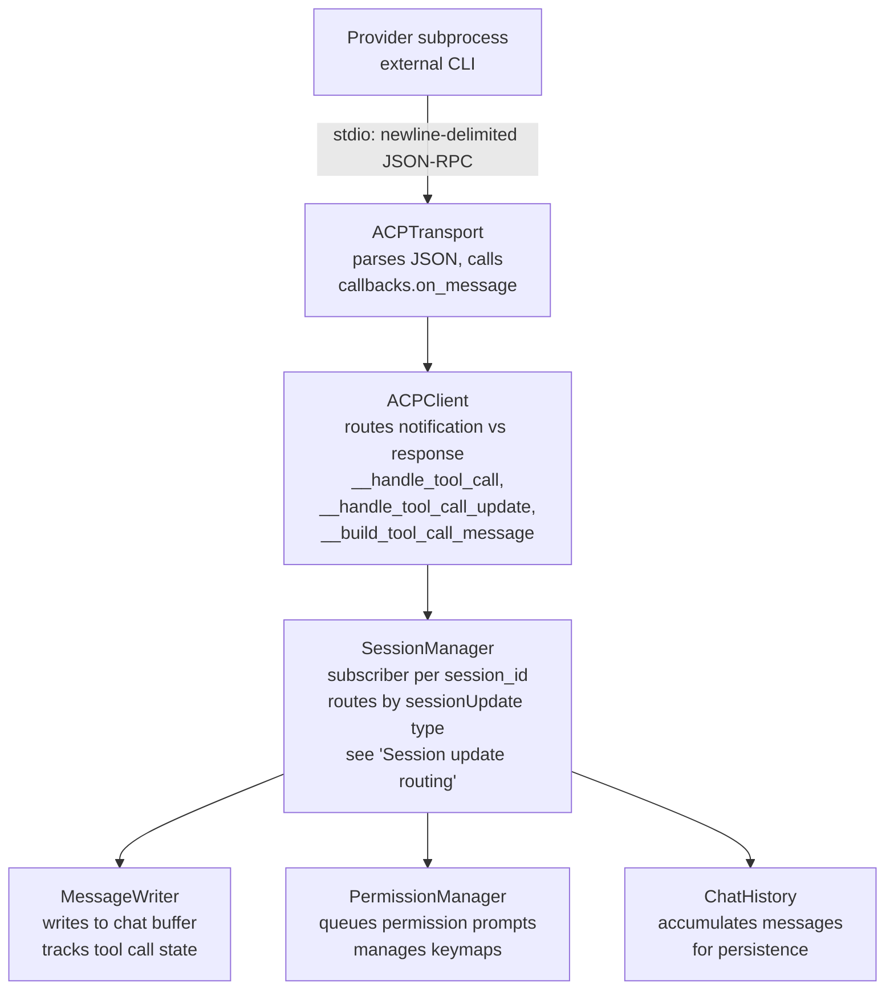
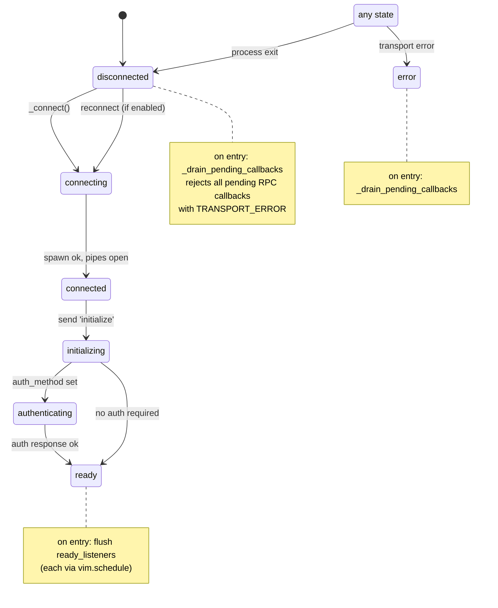
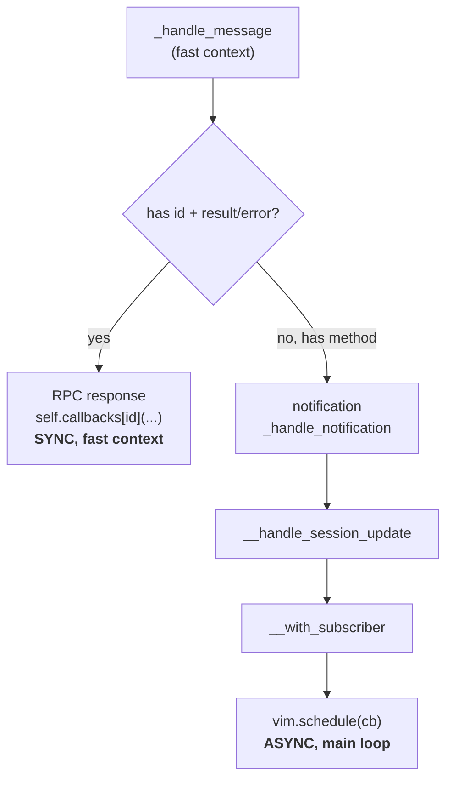
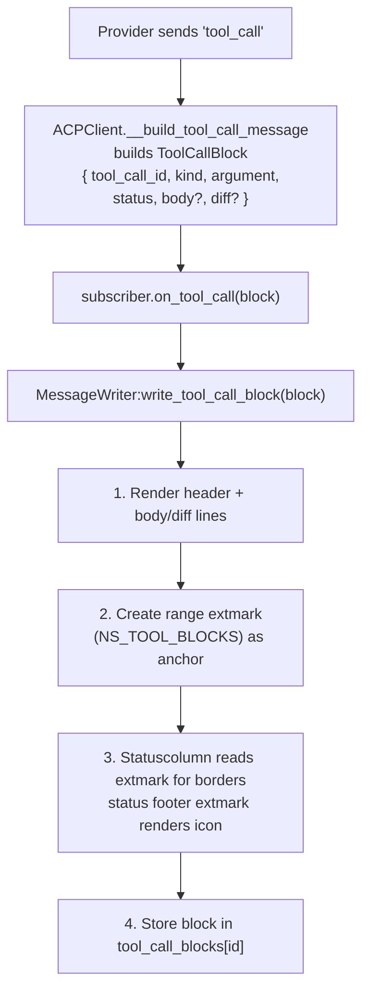
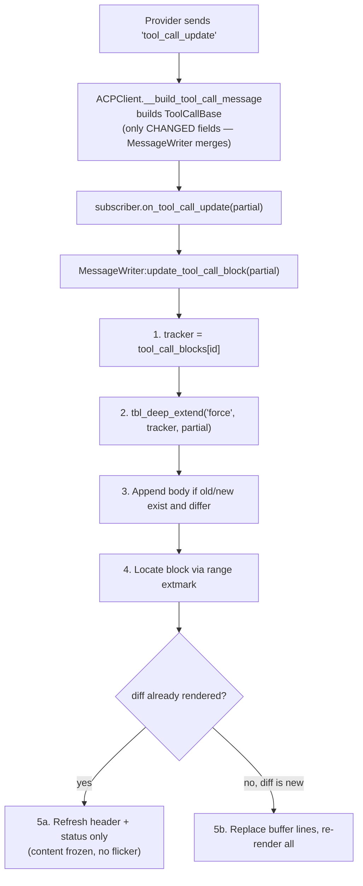
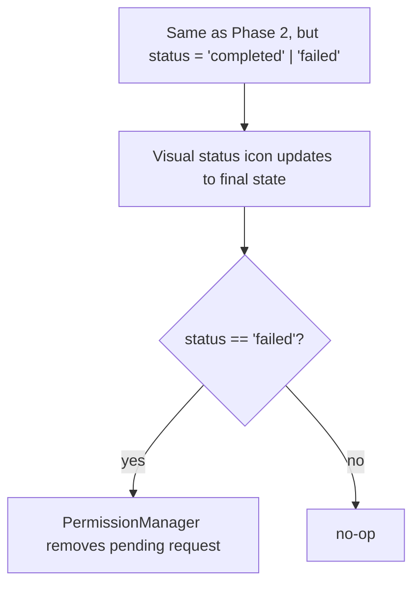
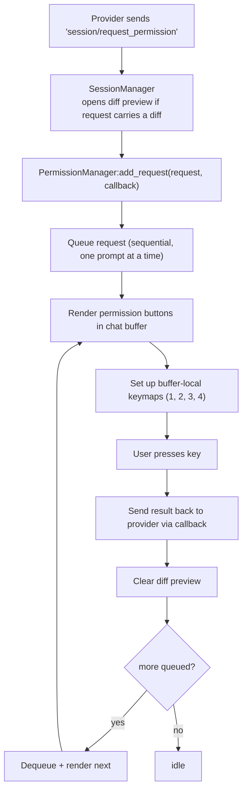

# Provider system

## ACP providers (Agent Client Protocol)

This plugin spawns **external CLI tools** as subprocesses and communicates via
the Agent Client Protocol:

- **Requirements**: External CLI tools must be installed by the user, we don't
  install them for security reasons.
  - `claude-agent-acp` for Claude
  - `gemini` for Gemini
  - `codex-acp` for Codex
  - `opencode` for OpenCode
  - `cursor-agent-acp` for Cursor Agent
  - `auggie` for Augment Code
  - `vibe-acp` for Mistral Vibe

NOTE: Install instructions are in the README.md

## Generic ACPClient (no per-provider adapters)

All providers use a **single generic `ACPClient`** (`acp_client.lua`). There are
no per-provider adapter files.

The client parses standard ACP protocol fields and handles provider quirks (e.g.
`rawInput` fallback for OpenCode) inline via protected methods in `ACPClient`
itself.

**Adding a new provider** only requires a config entry in `config_default.lua`
under `acp_providers` — no adapter code needed unless the provider deviates from
ACP in ways not yet handled.

## ACP provider configuration

```lua
acp_providers = {
  ["claude-agent-acp"] = {
    name = "Claude Agent ACP",
    command = "claude-agent-acp",
    env = {
      NODE_NO_WARNINGS = "1",
      IS_AI_TERMINAL = "1",
    },
  },
  ["gemini-acp"] = {
    name = "Gemini ACP",
    command = "gemini",
    args = { "--acp" },
    env = {
      NODE_NO_WARNINGS = "1",
      IS_AI_TERMINAL = "1",
    },
  },
}
```

## Event pipeline (top to bottom)



## ACPClient lifecycle (state machine)

State lives on `ACPClient.state`. The transport's `on_state_change`
callback drives `connecting -> connected -> error | disconnected`. The
RPC responses to `initialize` and `authenticate` drive the rest.



Invariants:

- `_drain_pending_callbacks` runs on every transition to
  `disconnected` or `error`. It rejects every pending RPC callback
  with `TRANSPORT_ERROR`. Without it, `send_prompt`, `create_session`,
  and the rest of `_send_request`-based calls hang forever when the
  provider dies.
- Reconnect (when `provider_config.reconnect` is true) loops back to
  `connecting`. `reconnect_count` on the client gates max attempts;
  the transport's `on_reconnect` callback reinvokes `_connect`.
- `_on_ready` fan-out: callers registered via `when_ready` before the
  client reaches `ready` are flushed (each via `vim.schedule`) at the
  moment of transition. After `ready`, new `when_ready` callers fire
  immediately (still via `vim.schedule`), so the callback contract is
  the same in both cases.

## Stdio transport line framing

The stdio transport reads from the provider's stdout in arbitrary
chunks. JSON-RPC messages are newline-delimited, but a single chunk
may split mid-message or carry several messages plus a partial
trailer.

```text
chunk 1:  ...{"jsonrpc":"2.0","i
                              ╰── partial, no newline yet
chunk 2:  d":1,...}\n{"jsonrpc":"2.0","method
          ╰─────────╯         ╰─────────────╯
          completes prior     partial again
```

The buffering loop in `acp_transport.create_stdio_transport`:

```text
chunks = chunks .. data
lines  = split(chunks, "\n")
chunks = lines[#lines]    -- keep partial trailer for next read
for i = 1, #lines - 1 do
    dispatch(decode(trim(lines[i])))
end
```

Invariants:

- `chunks` always holds the unterminated tail across reads.
- A single read can dispatch zero or more complete messages.
- Empty/whitespace-only lines are skipped, not dispatched.
- JSON-decode failures `Logger.notify` and continue; they do not
  corrupt the buffer.

Why preserved: large payloads (tool-call diffs, big agent message
chunks) routinely exceed a single pipe-read. Dropping the
partial-tail buffer turns every multi-chunk message into a JSON parse
error that surfaces as silent message loss.

## Sync vs async dispatch

`ACPClient:_handle_message` runs inside the libuv stdout callback,
i.e. in fast event context. The two dispatch branches differ in where
the user-supplied callback ultimately runs:



Implications for callers:

- RPC callbacks passed to `_send_request` (used by `create_session`,
  `send_prompt`, `set_mode`, `set_model`, `set_config_option`,
  `load_session`, `list_sessions`, `authenticate`, `initialize`) fire
  in fast context. Buffer writes, most `vim.api.*` calls, and
  `Logger.notify` from those callbacks crash with a fast-context
  error. Wrap their bodies in `vim.schedule`.
  `session_manager._handle_input_submit` already does this for the
  `send_prompt` response.
- Session-update notifications already cross the `vim.schedule`
  boundary inside `ACPClient`, so subscribers (`SessionManager:_on_*`)
  run on the main loop. No extra `vim.schedule` needed there.
- `vim.schedule` preserves FIFO order: subscribers see notifications
  in the order the provider sent them, even when one libuv read
  delivers many messages at once. No batching, no reordering. If the
  UI ever appears to "batch" updates after a delay, the buffering is
  upstream (provider stdout), not here.

Why preserved:

- Wrapping the RPC branch in `vim.schedule` too would defer the
  `initialize` handler that flips state to `ready` and drains
  `ready_listeners`. Deferring it lets notifications that arrive in
  the same libuv read observe `state == "initializing"` and behave
  inconsistently.
- Running the notification branch synchronously would put UI writes
  (`MessageWriter:write_message_chunk` calls `nvim_buf_set_text`)
  into fast context and crash.

## Session update routing

`ACPClient` receives `session/update` notifications. The `sessionUpdate` field
determines routing:

| `sessionUpdate` value   | Routed to                                  |
| ----------------------- | ------------------------------------------ |
| `"tool_call"`           | `__handle_tool_call` → subscriber          |
| `"tool_call_update"`    | `__handle_tool_call_update` → subscriber   |
| `"agent_message_chunk"` | `MessageWriter:write_message_chunk()`      |
| `"agent_thought_chunk"` | `MessageWriter:write_message_chunk()`      |
| `"plan"`                | `TodoList.render()`                        |
| `"request_permission"`  | `PermissionManager` (queued, sequential)   |
| others                  | `subscriber.on_session_update()` (generic) |

## Tool call lifecycle

Tool calls go through **3 phases**. `MessageWriter` tracks each via
`tool_call_blocks[tool_call_id]`, persisting state across all phases.

**Phase 1 — `tool_call` (initial)**



**Phase 2 — `tool_call_update` (one or more)**



**Phase 3 — final `tool_call_update` with terminal status**



## Key design rules

- **Updates are partial:** Only send what changed. MessageWriter merges onto the
  existing tracker via `tbl_deep_extend`.
- **Diffs are immutable after first render:** Once a diff is written to the
  buffer, content is frozen. Only header/status refresh on subsequent updates.
- **Body accumulates:** Multiple updates with different body content get
  concatenated with `---` dividers, not replaced.
- **Extmarks as position anchors:** Range extmark in `NS_TOOL_BLOCKS`
  auto-adjusts when buffer content shifts. Single source of truth for block
  position.

## Provider quirk handling

Instead of per-provider adapters, `ACPClient` handles protocol deviations inline
in `__build_tool_call_message`:

- **`rawInput` fallback** (OpenCode): when `content` is missing for `edit` kind
  tool calls, builds diff from `rawInput.new_string`/`rawInput.newString` fields
- **`locations` fallback**: extracts `file_path` from `update.locations[0].path`
  when not in `rawInput`
- **Unknown kinds**: logs a warning for unrecognized `kind` values so users
  report them as issues

To handle a new provider quirk, add the fallback logic in
`__build_tool_call_message` with a comment explaining which provider needs it.

## Permission flow (interleaved with tool calls)



## Protected methods in ACPClient

These protected methods can be overridden by subclasses if a future provider
requires it, but currently all providers use the default implementations:

| Method                        | Behavior                                  |
| ----------------------------- | ----------------------------------------- |
| `__handle_tool_call`          | Builds ToolCallBlock, notifies subscriber |
| `__build_tool_call_message`   | Parses ACP fields + quirk fallbacks       |
| `__handle_tool_call_update`   | Builds partial, notifies subscriber       |
| `__handle_request_permission` | Sends result back to provider             |
| `__handle_session_update`     | Routes by `sessionUpdate` type            |
