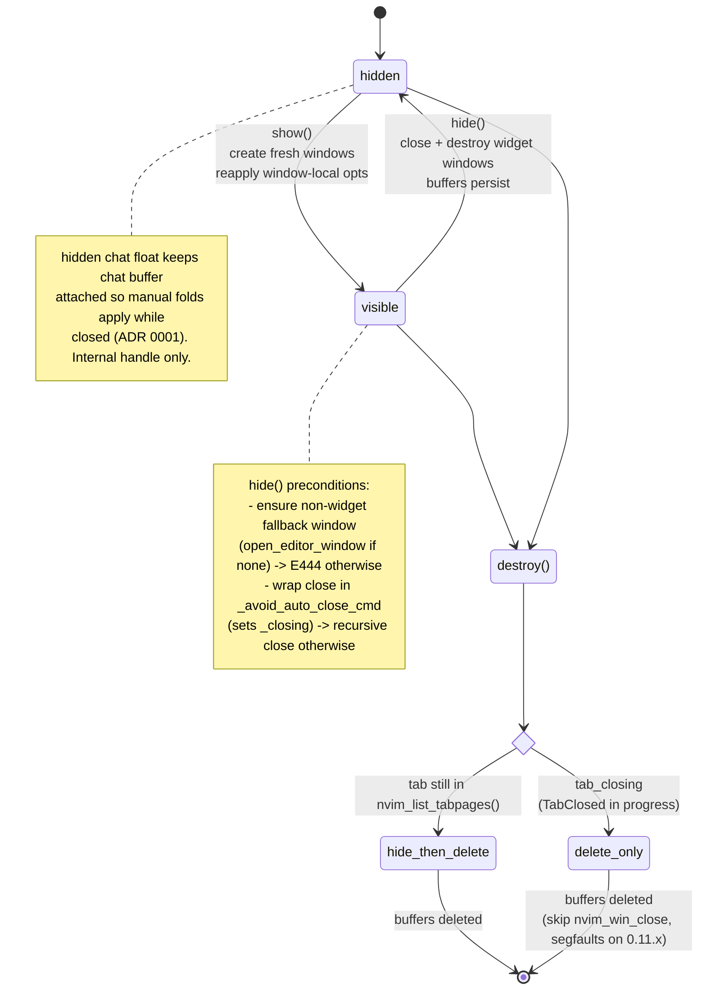

# UI / chat buffer

Hard rules and traps. Read code before changing behavior.

## Anti-staleness rules for this doc

- Cite module + symbol, never line numbers.
- Code blocks describe shape (topology, layouts, decision trees), never
  implementation.
- Every "why" must reference an observable failure (flicker, crash, lost fold).
  If the failure is gone, delete the rule.

## Topology

```text
SessionManager (per tab)
└── ChatWidget (per tab)  owns buffers + windows + autocmds
    ├── WidgetLayout      open/close/resize panels, applies PANEL_WINDOW_OPTS
    ├── _hidden_chat_winid  float keeping chat buffer attached while widget
    │                       hidden — managed by ChatWidget._hidden_chat_winid
    │                       + WidgetLayout.open_hidden_chat_window — ADR 0001
    ├── BufferGuard       redirects foreign buffers out of widget windows
    ├── WindowDecoration  winbar + buf names, headers in vim.t[tab]
    ├── DiffPreview       inline/split diff in real file buf (not chat)
    └── MessageWriter (per chat bufnr) ── owns chat-buffer content
        ├── tool_call_blocks    id -> ToolCallBlock (extmark-tracked range)
        ├── ToolCallFold        manual folds, anchor pads — ADR 0001
        ├── ToolCallDiff        diff extraction + minimization
        ├── DiffHighlighter     line/word hl on chat buffer
        │                       (lives in agentic.utils, not ui)
        ├── ToolBlockBorder     ╭ │ ╰ fence glyphs via statuscolumn — ADR 0002
        └── PermissionManager   pending map + focus state; rebinds per-block
                                keymaps on focus transition. Button row +
                                status row rendering owned by MessageWriter
                                (repaint_status_row -> _render_permission_section)
```

## Lifecycle

Widget windows are disposable.



- `hide` closes and destroys every widget window.
- Buffers persist.
- `show` creates fresh windows on every call and reapplies every window-local
  option. There is no "resume" path.
- Before closing widget windows, `hide` ensures a non-widget fallback window
  exists in the same tabpage. If `find_first_non_widget_window` returns nil, it
  calls `open_editor_window` to create one. Skipping this fires E444 (cannot
  close last window). See `ChatWidget:hide`.
- Programmatic window closes (`hide`, layout rotation) MUST wrap the close call
  in `ChatWidget:_avoid_auto_close_cmd`. The wrapper sets `self._closing = true`
  so the global `WinClosed` autocmd's auto-close-on-user-close branch skips the
  call. Skipping the wrapper triggers recursive close via the autocmd.
- `destroy` only calls `hide` when the tabpage is still in
  `nvim_list_tabpages()`. During `TabClosed`, the id is removed from that list
  but `nvim_tabpage_is_valid` still returns true and Neovim has already torn the
  windows down — calling `nvim_win_close` then segfaults on 0.11.x. After the
  conditional `hide`, the buffers are deleted. See `ChatWidget:destroy` for the
  `tab_closing` check.
- A hidden chat floating window keeps the chat buffer attached while the widget
  is hidden, so manual folds can be applied while closed. See ADR 0001.
  - Opened with `hide = true` + `focusable = false` + `noautocmd = true`. The
    user cannot reach it: `<C-w>w`/`<C-w>p`, `:wincmd`, and `:buffer` skip it;
    `nvim_list_wins()` returns it but interactive navigation does not visit it.
    Only code holding `widget._hidden_chat_winid` can target it (via
    `nvim_set_current_win`/`nvim_win_set_buf`). Treat it as an internal handle,
    not a window the user might be sitting in. Do NOT add keymaps,
    buffer-local autocmds expecting user focus, or any UX that assumes the user
    can act inside it.

## Hard rules

Each rule's observable failure is documented in the matching Traps bullet below
or in the linked ADR — failures are not inlined here to avoid duplication.

- `wrap` stays on. Never propose disabling it.
- Cursor positioning is `G0zb`, not `G$zb`. Column moves disrupt cursor
  animations; column 0 is the anchor.
- Cursor sits on the trailing `""` line below the last block, never inside a
  tool call block.
- `scrolloff = 4` on chat keeps room for spinner virt_lines above the cursor.
- Auto-scroll: call `MessageWriter:_capture_scroll(bufnr)` before mutation and
  `MessageWriter:_apply_scroll(bufnr)` after, same tick. No `vim.schedule`
  between the two — separate ticks let a redraw run with stale topline and
  flicker.
  - `_apply_scroll` skips the `G0zb` reapply when the user's cursor is farther
    than `Config.auto_scroll.threshold` lines from the bottom. This is
    intentional sticky-reading behavior, not a bug — the user stopped following
    the stream and we preserve their position.
  - `_check_auto_scroll` also returns false when the cursor row has
    permission-button extmarks in `NS_STATUS`. This avoids a
    `PermissionManager` back-reference in `MessageWriter`.
- Tool-call body updates replace only the body between stable anchor pads; the
  whole block range is never replaced.
- Manual folds only. Never `foldexpr`. Before proposing a `foldexpr` workaround
  (self-assign cache invalidation, `BufEnter` reapply, etc.), read the
  rejected-alternatives table in ADR 0001 — every obvious workaround has been
  tried and documented.
- Permission buttons live one-per-row between `bottom_pad` and the status row
  of each pending block, with empty spacer rows between buttons and one
  trailing spacer above the status row (`K = 2 * N` rendered rows for N
  options). Those rows are outside the fold range alongside the status row,
  and digit keymaps are bound only while a block is focused
  (`permission_manager.test.lua::digit keymap lifecycle::"rebinds digit keymaps with new mapping after focus transition"`).
- Cycle keys (`h`/`l`/`j`/`k`/arrows) and `<CR>` are row-gated: they fire
  only when the cursor sits on a button row or on the status row of the
  focused block. Spacer rows fall through to default motion.
- `tracker._rendered_button_count` lags the rendered state by one
  `repaint_status_row` tick. Read it ONLY from the render path (the writer
  itself, never from `PermissionManager` or external code).
- Foreign buffers in widget windows are redirected via `BufferGuard`
  (`lua/agentic/ui/buffer_guard.lua`) to a non-widget window in the same
  tabpage.
- Panel + fold window options (`WidgetLayout.PANEL_WINDOW_OPTS`,
  `Fold.setup_window`) MUST be written via `vim.wo[winid][0]`. See the
  general `:set`-style ban in root `AGENTS.md` "Common traps". Regression:
  `buffer_guard.test.lua::"does not leak widget window options to the editor window after redirect"`.
- Module-level state is forbidden for per-tab data. Namespace IDs are exempt —
  IDs are global, isolation comes from per-buffer `nvim_buf_clear_namespace`.

## Tool-call block layout

```text
row 0          header         rewritten on every update, NOT folded
row 1          "" top_pad     fold start anchor
row 2..M-1     body           replaced on every update
row M          "" bottom_pad  fold end anchor
row M+1..M+K   permission     K rows: N button rows + N empty spacer rows
                              (interleaved; trailing spacer above the
                              status row). K = 0 when no permission is
                              pending. Outside the fold.
row M+K+1      status row     real text, outside the fold.
```

`K` counts rows, not buttons (`K = 2 * N` for N options). All of `M+1..M+K+1`
is rendered together by `MessageWriter:_render_permission_section`.

Pads are unconditional. Header is rewritten unconditionally because providers
send placeholder titles before the real one. Permission rows only appear
while a request is pending on the block; otherwise K = 0 and the status row
sits directly below `bottom_pad`.

## Special write paths

Three `MessageWriter` methods bypass the normal `_maybe_write_sender_header`
flow. Picking the wrong one breaks message attribution silently.

| Method                     | When to use                                                 | Bypasses                               |
| -------------------------- | ----------------------------------------------------------- | -------------------------------------- |
| `write_structural_message` | Welcome banner on session open; banner before restore.      | Sender-header dedup (one-shot reset).  |
| `write_restoring_message`  | Per-message replay during session restore.                  | Timestamps in user header.             |
| `replay_history_messages`  | Provider switch only — bulk repaint from in-memory history. | Both above (delegates to sub-writers). |

Rules:

- Outside restore and provider-switch, NEVER call these. Use
  `write_message_chunk` / `write_tool_call_block`.
- `replay_history_messages` is the only caller that loops over saved
  messages. It does NOT re-issue ACP `send_prompt`; the new provider sees no
  prior context.
- Adding a new bulk-write path means adding a fourth row here and a test.

## TodoList (separate buffer)

`TodoList` lives in its own buffer (`ChatWidget.buf_nrs.todos`) and its own
window, opened after diagnostics in `WidgetLayout`. Gated by
`Config.windows.todos.display` (default true).

- Hidden until first **Plan** event arrives.
- Auto-closes its window via `close_if_all_completed` when every task is
  done.
- No keymaps — read-only display.
- Plan updates and chat chunks target different buffers.

## Sender classification

`MessageWriter:_maybe_write_sender_header` resolves the sender from
`update.sessionUpdate`. New `sessionUpdate` types must be classified here;
unmapped types get no header and break message attribution.

```text
user_message_chunk     ───▶ user
agent_message_chunk    ─┐
agent_thought_chunk    ─┼─▶ agent
tool_call              ─┘
plan                   ───▶ (no header)
```

Bypass paths: see "Special write paths" above. Read those methods before
adding a new `sessionUpdate` type.

- Thinking blocks (`agent_thought_chunk`) reuse one extmark in `NS_THINKING`
  across chunks. Any non-thought write must call
  `MessageWriter:_clear_thinking_state` first; otherwise the next thought
  extends the wrong extmark. Read `write_message_chunk` for the reuse pattern.

## Traps

- `style = "minimal"` on panel windows
  - Stores empty fold map in the buffer's last-window memory; wipes manual folds
    across reopens.
- Setting `foldmethod` / `foldlevel` unconditionally
  - Only `Fold.setup_window` (in `lua/agentic/ui/tool_call_fold.lua`) is allowed
    to write these. The set-handler triggers even on no-op assigns, closing the
    user's `zo`-opened folds. See ADR 0001.
- `vim.schedule` between mutation and `G0zb`
  - Separate tick lets a redraw run with stale topline -> flicker.
- Replacing the whole tool-call range with `set_lines`
  - Manual fold dies. Always slice body between anchors.
- Querying windows globally for tab-scoped lookups
  - Hits other tabs' chat windows. Use
    `nvim_tabpage_list_wins(self.tab_page_id)`.
- Calling `nvim_win_close` after tabclose
  - Handle returns valid from `nvim_win_is_valid` but segfaults on 0.11.5. In
    `WidgetLayout.close`, check
    `nvim_tabpage_is_valid(nvim_win_get_tabpage(winid))` per window before
    `nvim_win_close` — not just once at the start of the loop.
- `vim.notify` directly
  - Fast-context errors. Use `Logger.notify`.
- Module-level mutable state for per-tab data
  - Cross-tab leakage. See root `AGENTS.md`.
- Two windows holding the chat buffer concurrently
  - Breaks fold-state preservation. ADR 0001.
- Reopening the hidden chat float without closing the previous one
  - Overwrites the stored winid and leaks the prior window.
- Re-rendering tool-call body after a diff is set
  - Once `tracker.diff` exists, only header + status refresh. Replacing body
    breaks preview consistency.
- `:edit` on a widget buffer
  - Buffer keeps its ID but gains a name and `buftype != "nofile"`.
    `BufferGuard` detects this on `BufWinEnter` and swaps a fresh scratch buffer
    into the widget window, redirecting the named buffer out. Re-grep
    `BufferGuard` for the exact entry point before refactoring.
- Mutating nested fields of `vim.t[tab].agentic_headers` in place
  - `vim.t` returns copies; nested edits do not persist. Read via
    `WindowDecoration.get_headers_state`, mutate, write back via
    `set_headers_state`.
- Overwriting the status row or button rows while a permission request is
  pending (K = rendered permission rows, see "Tool-call block layout")
  - `MessageWriter:update_tool_call_block` ends up calling
    `repaint_status_row(tracker.tool_call_id)`, which delegates to
    `_render_permission_section`. The renderer reads `tracker.permission`
    (the state stored by `PermissionManager`) and rewrites the K rows
    plus the status row in one transaction, so updates that arrive while
    buttons are visible re-render the buttons rather than wipe them. If you
    bypass `_render_permission_section` and write to those rows directly,
    buttons disappear until the next focus event triggers a repaint.
- Direct `nvim_buf_set_name` for widget buffers
  - Session restore (e.g. `mksession` with `blank` in `sessionoptions`)
    persists agentic buffer names; direct calls raise E95 on reopen. Use
    `WindowDecoration._set_buffer_name`, which renames any pre-existing
    holder to `<name>-old-N`. Regression:
    `lua/agentic/ui/window_decoration.test.lua`.

## Test invariants

Each invariant has an existing regression test. Deleting one is a behavior
change.

- Fold survives window close + reopen —
  `tool_call_fold.test.lua::setup_window::"preserves fold ranges across window close + reopen"`.
- Fold creation gated by screen-row count > threshold —
  `tool_call_fold.test.lua::should_fold::"folds when screen-row count exceeds threshold"`.
- Fold counts wrapped rows, not buffer lines (one mega-line still folds) —
  `tool_call_fold.test.lua::should_fold::"folds a single buffer line that wraps past the threshold"`.
- Status row + permission rows are real text rendered per state —
  `message_writer.test.lua::status row::"writes the status word as real text at row N for non-pending blocks"`,
  `..::"renders buttons one per row for pending non-focused permission state"`,
  `..::"renders buttons one per row with digit prefixes when focused"`.
- Block range extmark grows by K on permission render
  (`end_right_gravity = true` regression) —
  `message_writer.test.lua::status row::_build_permission_section button rows::"extmark end_row grows by K on permission render (end_right_gravity regression)"`.
- Focus transition triggers exactly 2 status-row repaints (old + new) —
  `permission_manager.test.lua::bracket cycle::"focus transition triggers exactly 2 status-row repaints"`.
- Digit keymap dispatches the focused block's option —
  `permission_manager.test.lua::digit keymap lifecycle::"digit 2 submits option 2"`,
  `..::"rebinds digit keymaps with new mapping after focus transition"`.
- Bracket cycle wraps and no-ops when pending is empty —
  `permission_manager.test.lua::bracket cycle::"forward cycle wraps to first"`,
  `..::"backward cycle wraps to last"`,
  `..::"cycle is a no-op when pending is empty"`.
- Concurrent map preserves insertion order and supports out-of-order resolve —
  `permission_manager.test.lua::concurrent pending map::*`.
- Sender header dedup on consecutive same-sender writes —
  `message_writer.test.lua::sender header tracking`.
- Auto-scroll threshold preserves reading position and permission-row cursor —
  `message_writer.test.lua::_check_auto_scroll`.
- Thinking-state cleared on non-thought writes —
  `message_writer.test.lua::thinking block highlighting::"clears thinking state on reset_sender_tracking, write_tool_call_block, and write_message"`.
- Widget window options do not leak to redirected buffers —
  `buffer_guard.test.lua::"does not leak widget window options to the editor window after redirect"`.
